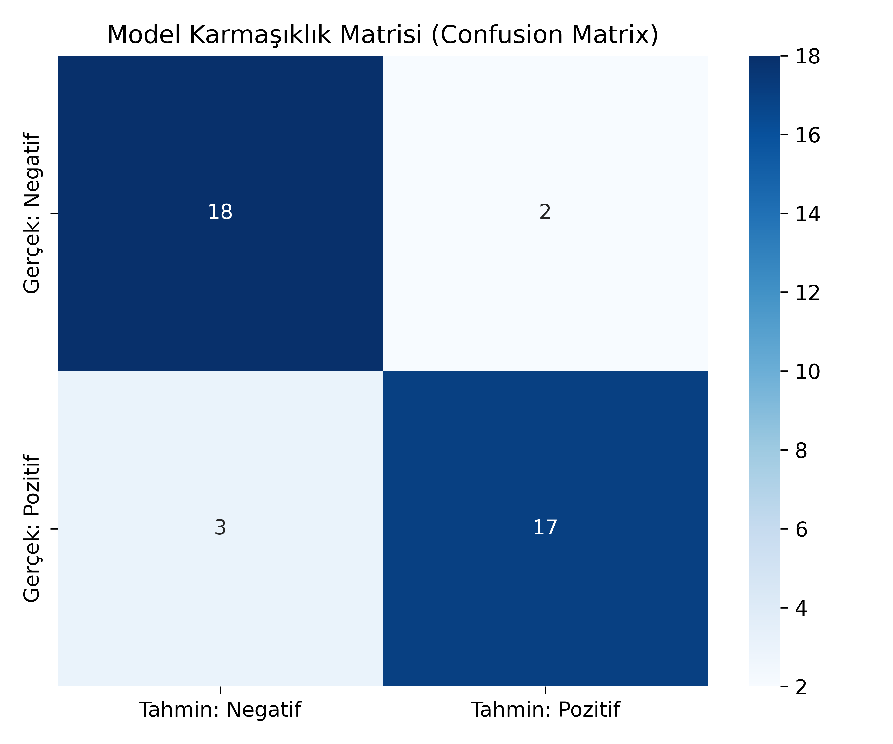

# 🎬 Movie Sentiment Analysis (Türkçe Film Yorumları Duygu Analizi)

Bu proje, Türkçe film yorumlarını analiz ederek yorumun **Olumlu (Positive)** veya **Olumsuz (Negative)** olduğunu tahmin eden makine öğrenmesi tabanlı bir Doğal Dil İşleme (NLP) uygulamasıdır. 

Proje; otomatik veri çekme ve temizleme (`fetch_dataset.py`), model eğitimi ve değerlendirme (`train.py`) ve eğitilen model ile canlı tahmin yapmayı sağlayan interaktif bir terminal arayüzü (`app.py`) sunar.

---

## 🚀 Öne Çıkan Özellikler

- **Veri Temizleme & Filtreleme:** Ham JSON verisi içerisindeki spam/reklamlar, çok kısa girdiler ve anlamsız yorumlar otomatik olarak elenir.
- **TF-IDF & Naive Bayes:** Metin vektörleştirme ve sınıflandırma için `scikit-learn` boru hattı (pipeline) yapısı kullanılmıştır.
- **Performans Raporlama & Görselleştirme:** Eğitim sonrasında doğruluk skoru, sınıflandırma metrikleri (Precision, Recall, F1) ve yüksek çözünürlüklü Karmaşıklık Matrisi (`confusion_matrix.png`) otomatik üretilir.
- **Defansif & Modüler Mimari:** Tüm betikler `__name__ == "__main__"` kontrolü, `try-except` hata blokları ve standart durum kodları (`exit(1)`) ile korumaya alınmıştır.

---

## 🛠️ Kurulum ve Kullanım

### 1. Kütüphane Bağımlılıklarının Yüklenmesi
Öncelikle gerekli kütüphaneleri yükleyin:

```bash
pip install -r requirements.txt
```

### 2. Veri Setinin Çekilmesi
Turkish NLP Suite deposundan veri setinin indirilip `dataset.json` dosyasını oluşturmak için:

```bash
python fetch_dataset.py
```

### 3. Modelin Eğitilmesi ve Değerlendirilmesi
Modeli eğitmek, başarı oranlarını görüntülemek ve `confusion_matrix.png` görselini üretmek için:

```bash
python train.py
```

### 4. İnteraktif Arayüzün Çalıştırılması
Eğitilen `sentiment_model.pkl` dosyasını yükleyip kendi film yorumlarınızı test etmek için:

```bash
python app.py
```

--- 

## 📊 Model Performansı
Modelin test verisi üzerindeki tahmin başarısını ve hata dağılımını gösteren Karmaşıklık Matrisi:



---

## 📑 Veri Seti ve Atıf

Bu projede kullanılan Türkçe film yorumları veri seti **Creative Commons** lisansı altındadır ve **Duygu Altınok** (Turkish NLP Suite / Google Developer Experts) tarafından derlenmiştir.

* **Veri Kaynağı:** [BeyazPerde Movie Reviews Dataset](https://github.com/turkish-nlp-suite/BeyazPerde-Movie-Reviews)
* **Lisans:** Creative Commons / Open Data

### Akademik Atıf (Citation)
Bu veri setini projelerinizde kullanırken lütfen aşağıdaki makaleye atıfta bulunun:

```bibtex
@inproceedings{altinok-2023-diverse,
    title = "A Diverse Set of Freely Available Linguistic Resources for {T}urkish",
    author = "Altinok, Duygu",
    booktitle = "Proceedings of the 61st Annual Meeting of the Association for Computational Linguistics (Volume 1: Long Papers)",
    month = jul,
    year = "2023",
    address = "Toronto, Canada",
    publisher = "Association for Computational Linguistics",
    url = "[https://aclanthology.org/2023.acl-long.768](https://aclanthology.org/2023.acl-long.768)",
    pages = "13739--13750"
}
```

## 📄 Lisans
Bu projenin kaynak kodları MIT License altında lisanslanmıştır. Detaylar için `LICENSE` dosyasına bakabilirsiniz.